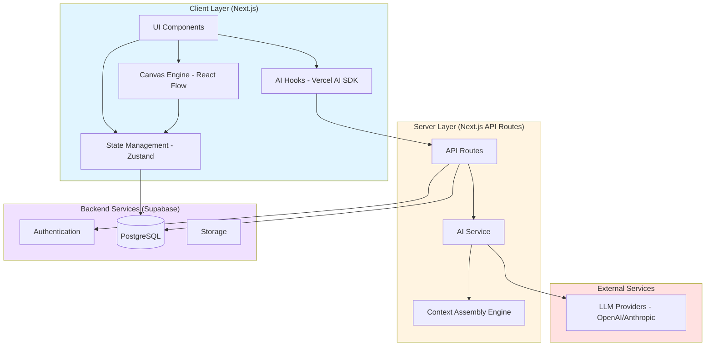
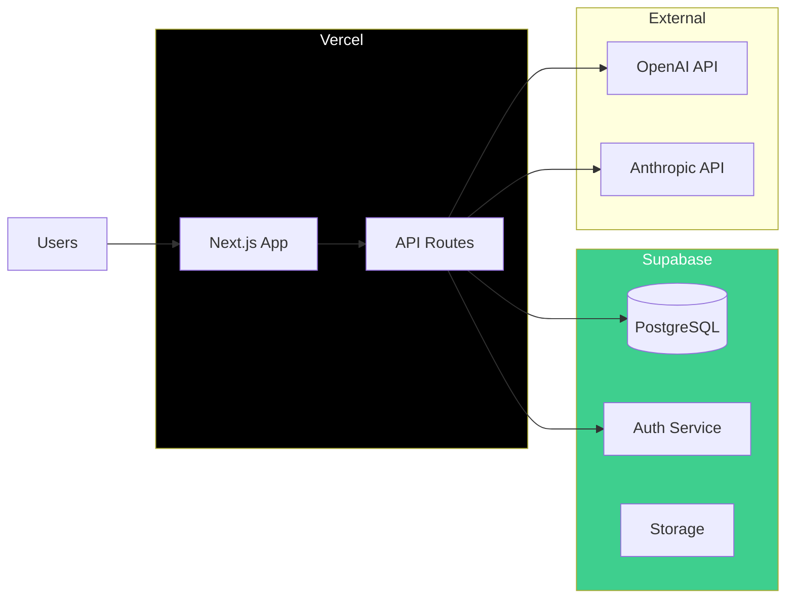

# Design Document: MindNode Canvas

## Overview

MindNode Canvas is a web-based application that transforms AI conversations from linear chat streams into spatial, tree-structured knowledge maps. The system leverages an infinite canvas interface powered by React Flow, enabling users to organize thoughts spatially, create precision branches through text selection, and maintain logical context inheritance across conversation depths.

The architecture follows a client-server model with real-time synchronization, utilizing Next.js for the frontend framework, Supabase for backend services (database, authentication, storage), and Vercel AI SDK for multi-model LLM integration with streaming support.

## Architecture

### High-Level Architecture



### Technology Stack

- **Frontend Framework**: Next.js 14+ (App Router)
- **Canvas Engine**: React Flow v11+ (node-based UI with built-in pan/zoom)
- **State Management**: Zustand (lightweight, suitable for tree structures)
- **Styling**: Tailwind CSS + Shadcn UI components + Lucide icons
- **Backend**: Supabase (PostgreSQL + Auth + Realtime)
- **AI Integration**: Vercel AI SDK (unified interface for multiple LLM providers)
- **Layout Algorithm**: Dagre (automatic tree layout)
- **Markdown**: react-markdown + remark-gfm

## Components and Interfaces

### Core Components

#### 1. Canvas Component (`CanvasWorkspace`)

The main infinite canvas container that manages the React Flow instance.

```typescript
interface CanvasWorkspaceProps {
  workspaceId: string;
  initialNodes: MindNode[];
  initialEdges: Edge[];
  onNodesChange: (nodes: MindNode[]) => void;
  onEdgesChange: (edges: Edge[]) => void;
}

// Key responsibilities:
// - Initialize React Flow with custom node types
// - Handle pan/zoom interactions
// - Manage viewport state
// - Coordinate node selection and focus
```

#### 2. Node Component (`MindNodeComponent`)

Custom React Flow node that renders individual conversation nodes.

```typescript
interface MindNodeComponentProps {
  id: string;
  data: {
    label: string;
    contextContent: string;
    selectionSource?: string;
    type: 'root' | 'user' | 'ai';
    isEditing: boolean;
    isGenerating: boolean;
    suggestions?: string[];
  };
  selected: boolean;
}

// Key responsibilities:
// - Render Markdown content in view mode
// - Provide textarea for edit mode
// - Handle text selection for branching
// - Display AI suggestions
// - Show loading states during generation
```

#### 3. Floating Toolbar (`SelectionToolbar`)

Appears when text is selected within a node.

```typescript
interface SelectionToolbarProps {
  selectedText: string;
  position: { x: number; y: number };
  onCreateBranch: (text: string) => void;
  onDismiss: () => void;
}

// Key responsibilities:
// - Position near text selection using getBoundingClientRect()
// - Provide "AI Branch" action button
// - Handle click outside to dismiss
```

#### 4. AI Suggestion Bubbles (`SuggestionBubbles`)

Displays intelligent follow-up questions near AI nodes.

```typescript
interface SuggestionBubblesProps {
  nodeId: string;
  suggestions: string[];
  onSuggestionClick: (suggestion: string) => void;
}

// Key responsibilities:
// - Render 3 suggestion bubbles
// - Handle click to create branch
// - Animate appearance after AI generation
```

#### 5. Workspace Sidebar (`WorkspaceSidebar`)

Manages workspace list and navigation.

```typescript
interface WorkspaceSidebarProps {
  workspaces: Workspace[];
  currentWorkspaceId: string;
  onWorkspaceSelect: (id: string) => void;
  onWorkspaceCreate: () => void;
  onWorkspaceDelete: (id: string) => void;
}
```

### State Management Architecture

Using Zustand with slice pattern for modularity:

```typescript
// Main store combining slices
interface MindNodeStore {
  // Canvas slice
  nodes: MindNode[];
  edges: Edge[];
  viewport: { x: number; y: number; zoom: number };
  selectedNodeId: string | null;
  
  // Actions
  addNode: (node: MindNode) => void;
  updateNode: (id: string, data: Partial<MindNode['data']>) => void;
  deleteNode: (id: string) => void;
  setSelectedNode: (id: string | null) => void;
  
  // AI slice
  generatingNodes: Set<string>;
  startGeneration: (nodeId: string) => void;
  stopGeneration: (nodeId: string) => void;
  
  // Workspace slice
  currentWorkspaceId: string;
  setWorkspace: (id: string) => void;
  
  // Selection slice
  selectedText: string | null;
  selectionPosition: { x: number; y: number } | null;
  setSelection: (text: string, position: { x: number; y: number }) => void;
  clearSelection: () => void;
}
```

### API Routes

#### 1. `/api/ai/generate` (POST)

Generates AI response with streaming support.

```typescript
interface GenerateRequest {
  nodeId: string;
  contextPath: ContextNode[];
  selectionSource?: string;
  userMessage?: string;
}

interface ContextNode {
  id: string;
  content: string;
  type: 'root' | 'user' | 'ai';
}

// Returns: Server-Sent Events stream with AI tokens
```

#### 2. `/api/ai/suggestions` (POST)

Generates follow-up suggestions for a node.

```typescript
interface SuggestionsRequest {
  nodeId: string;
  nodeContent: string;
  contextPath: ContextNode[];
}

interface SuggestionsResponse {
  suggestions: string[]; // Array of 3 suggestions, max 15 chars each
}
```

#### 3. `/api/workspaces/[id]` (GET, PUT, DELETE)

CRUD operations for workspaces.

#### 4. `/api/nodes` (POST, PUT, DELETE)

CRUD operations for nodes with real-time sync.

## Data Models

### Database Schema (Supabase PostgreSQL)

```sql
-- Users table (managed by Supabase Auth)
-- Automatically created by Supabase

-- Workspaces table
CREATE TABLE workspaces (
  id UUID PRIMARY KEY DEFAULT uuid_generate_v4(),
  user_id UUID NOT NULL REFERENCES auth.users(id) ON DELETE CASCADE,
  title VARCHAR(255) NOT NULL,
  root_node_id UUID,
  created_at TIMESTAMP WITH TIME ZONE DEFAULT NOW(),
  updated_at TIMESTAMP WITH TIME ZONE DEFAULT NOW(),
  viewport_x FLOAT DEFAULT 0,
  viewport_y FLOAT DEFAULT 0,
  viewport_zoom FLOAT DEFAULT 1
);

-- Nodes table
CREATE TABLE nodes (
  id UUID PRIMARY KEY DEFAULT uuid_generate_v4(),
  workspace_id UUID NOT NULL REFERENCES workspaces(id) ON DELETE CASCADE,
  parent_id UUID REFERENCES nodes(id) ON DELETE CASCADE,
  type VARCHAR(20) NOT NULL CHECK (type IN ('root', 'user', 'ai')),
  content TEXT NOT NULL,
  selection_source TEXT,
  position_x FLOAT NOT NULL,
  position_y FLOAT NOT NULL,
  created_at TIMESTAMP WITH TIME ZONE DEFAULT NOW(),
  updated_at TIMESTAMP WITH TIME ZONE DEFAULT NOW()
);

-- Edges table (derived from parent_id relationships)
-- Can be computed on-the-fly or cached for performance

-- Indexes
CREATE INDEX idx_nodes_workspace ON nodes(workspace_id);
CREATE INDEX idx_nodes_parent ON nodes(parent_id);
CREATE INDEX idx_workspaces_user ON workspaces(user_id);
```

### TypeScript Data Models

```typescript
interface Workspace {
  id: string;
  userId: string;
  title: string;
  rootNodeId: string | null;
  createdAt: Date;
  updatedAt: Date;
  viewport: {
    x: number;
    y: number;
    zoom: number;
  };
}

interface MindNode {
  id: string;
  workspaceId: string;
  parentId: string | null;
  type: 'root' | 'user' | 'ai';
  data: {
    label: string; // Rendered content (Markdown)
    contextContent: string; // Full content for context assembly
    selectionSource?: string; // Original selected text if branch
    isEditing?: boolean; // UI state
    isGenerating?: boolean; // UI state
    suggestions?: string[]; // AI-generated suggestions
  };
  position: {
    x: number;
    y: number;
  };
  createdAt: Date;
  updatedAt: Date;
}

interface Edge {
  id: string;
  source: string; // Parent node ID
  target: string; // Child node ID
  type?: 'default' | 'smoothstep';
}
```

## Context Assembly Engine

This is the core algorithm that enables logical context inheritance.

### Algorithm: Path Traversal and Context Building

```typescript
function assembleContext(
  nodeId: string,
  nodes: Map<string, MindNode>
): ContextNode[] {
  const path: ContextNode[] = [];
  let currentId: string | null = nodeId;
  
  // Traverse from current node to root
  while (currentId !== null) {
    const node = nodes.get(currentId);
    if (!node) break;
    
    path.unshift({
      id: node.id,
      content: node.data.contextContent,
      type: node.type,
      selectionSource: node.data.selectionSource
    });
    
    currentId = node.parentId;
  }
  
  return path;
}
```

### Prompt Construction Strategy

```typescript
function buildAIPrompt(
  contextPath: ContextNode[],
  userMessage?: string,
  selectionSource?: string
): string {
  const systemPrompt = `You are a logical analysis expert participating in a deep exploration within a mind map structure. Provide focused, contextual responses based on the conversation path.`;
  
  const contextSection = contextPath
    .map((node, idx) => {
      const prefix = node.type === 'user' ? 'User' : 'Assistant';
      let content = `${prefix}: ${node.content}`;
      
      // Highlight selection source if present
      if (node.selectionSource) {
        content += `\n[Selected text: "${node.selectionSource}"]`;
      }
      
      return content;
    })
    .join('\n\n');
  
  let finalPrompt = `${systemPrompt}\n\n## Conversation Path:\n${contextSection}`;
  
  if (selectionSource) {
    finalPrompt += `\n\n## User Selected Text:\n"${selectionSource}"`;
  }
  
  if (userMessage) {
    finalPrompt += `\n\n## User Question:\n${userMessage}`;
  }
  
  finalPrompt += `\n\nInstruction: Provide a focused response based on the context path${selectionSource ? ' and the specific selected text' : ''}.`;
  
  return finalPrompt;
}
```

### Token Limit Handling

When context exceeds model token limits:

1. **Priority-based truncation**: Keep root node + recent nodes + current selection
2. **Summarization**: Use a separate AI call to summarize middle nodes
3. **User notification**: Warn when context is truncated

## Layout Engine

Using Dagre for automatic tree layout:

```typescript
import dagre from 'dagre';

function getLayoutedElements(
  nodes: MindNode[],
  edges: Edge[],
  direction: 'TB' | 'LR' = 'LR'
): { nodes: MindNode[]; edges: Edge[] } {
  const dagreGraph = new dagre.graphlib.Graph();
  dagreGraph.setDefaultEdgeLabel(() => ({}));
  
  const nodeWidth = 300;
  const nodeHeight = 150;
  
  dagreGraph.setGraph({ 
    rankdir: direction,
    nodesep: 80,
    ranksep: 150
  });
  
  nodes.forEach((node) => {
    dagreGraph.setNode(node.id, { width: nodeWidth, height: nodeHeight });
  });
  
  edges.forEach((edge) => {
    dagreGraph.setEdge(edge.source, edge.target);
  });
  
  dagre.layout(dagreGraph);
  
  const layoutedNodes = nodes.map((node) => {
    const nodeWithPosition = dagreGraph.node(node.id);
    return {
      ...node,
      position: {
        x: nodeWithPosition.x - nodeWidth / 2,
        y: nodeWithPosition.y - nodeHeight / 2,
      },
    };
  });
  
  return { nodes: layoutedNodes, edges };
}
```

## Selection-Based Branching Implementation

### Text Selection Detection

```typescript
function useTextSelection(nodeId: string) {
  const [selection, setSelection] = useState<{
    text: string;
    position: { x: number; y: number };
  } | null>(null);
  
  useEffect(() => {
    const handleSelectionChange = () => {
      const sel = window.getSelection();
      if (!sel || sel.isCollapsed) {
        setSelection(null);
        return;
      }
      
      const selectedText = sel.toString().trim();
      if (selectedText.length === 0) {
        setSelection(null);
        return;
      }
      
      // Check if selection is within our node
      const range = sel.getRangeAt(0);
      const container = range.commonAncestorContainer;
      const nodeElement = document.querySelector(`[data-node-id="${nodeId}"]`);
      
      if (!nodeElement?.contains(container)) {
        setSelection(null);
        return;
      }
      
      // Get position for floating toolbar
      const rect = range.getBoundingClientRect();
      setSelection({
        text: selectedText,
        position: {
          x: rect.left + rect.width / 2,
          y: rect.top - 10 // Position above selection
        }
      });
    };
    
    document.addEventListener('selectionchange', handleSelectionChange);
    return () => document.removeEventListener('selectionchange', handleSelectionChange);
  }, [nodeId]);
  
  return selection;
}
```

## AI Streaming Integration

Using Vercel AI SDK for streaming responses:

```typescript
// API Route: /api/ai/generate
import { streamText } from 'ai';
import { openai } from '@ai-sdk/openai';

export async function POST(req: Request) {
  const { contextPath, selectionSource, userMessage } = await req.json();
  
  const prompt = buildAIPrompt(contextPath, userMessage, selectionSource);
  
  const result = await streamText({
    model: openai('gpt-4-turbo'),
    messages: [
      { role: 'system', content: prompt }
    ],
    temperature: 0.7,
    maxTokens: 1000,
  });
  
  return result.toTextStreamResponse();
}

// Client-side hook
function useAIGeneration(nodeId: string) {
  const { messages, append, isLoading } = useChat({
    api: '/api/ai/generate',
    id: nodeId,
    streamProtocol: 'text',
  });
  
  return { messages, append, isLoading };
}
```

## Suggestion Generation

```typescript
// API Route: /api/ai/suggestions
export async function POST(req: Request) {
  const { nodeContent, contextPath } = await req.json();
  
  const prompt = `Based on this conversation context and the latest AI response, generate exactly 3 follow-up questions that a curious learner might ask. Each question must be 15 characters or less.

Context Path:
${contextPath.map(n => n.content).join('\n')}

Latest Response:
${nodeContent}

Return only the 3 questions, one per line, no numbering or formatting.`;
  
  const result = await generateText({
    model: openai('gpt-4-turbo'),
    prompt,
    temperature: 0.8,
    maxTokens: 100,
  });
  
  const suggestions = result.text
    .split('\n')
    .filter(s => s.trim().length > 0)
    .slice(0, 3)
    .map(s => s.trim().substring(0, 15));
  
  return Response.json({ suggestions });
}
```


## Correctness Properties

*A property is a characteristic or behavior that should hold true across all valid executions of a system—essentially, a formal statement about what the system should do. Properties serve as the bridge between human-readable specifications and machine-verifiable correctness guarantees.*

### Property 1: Zoom Focal Point Preservation

*For any* canvas viewport and cursor position, when zooming in or out, the point under the cursor should remain at the same screen position relative to the cursor.

**Validates: Requirements 1.2**

### Property 2: Viewport Culling Correctness

*For any* set of nodes and viewport bounds, only nodes whose bounding boxes intersect with the viewport should be marked for rendering.

**Validates: Requirements 1.3**

### Property 3: Tab Creates Child Node

*For any* selected node, pressing Tab should create exactly one child node with the selected node as its parent, positioned to the right.

**Validates: Requirements 2.1**

### Property 4: Enter Creates Sibling Node

*For any* selected node with a parent, pressing Enter should create a sibling node with the same parent, positioned below the selected node.

**Validates: Requirements 2.2**

### Property 5: Layout Non-Overlap Invariant

*For any* set of nodes after layout algorithm is applied, no two node bounding boxes should overlap (intersection area = 0).

**Validates: Requirements 2.3, 8.2**

### Property 6: Markdown Round-Trip Preservation

*For any* valid Markdown string, rendering it to view mode then extracting back to edit mode should produce an equivalent Markdown string.

**Validates: Requirements 2.4, 9.4**

### Property 7: Cascade Deletion Completeness

*For any* node in a tree, deleting that node should remove it and all its descendants (transitive closure of children) from the canvas.

**Validates: Requirements 2.6**

### Property 8: Context Path Ordering

*For any* node in the tree, assembling its context should produce a path ordered from root to the node, with no gaps or duplicates.

**Validates: Requirements 3.2, 5.1**

### Property 9: Selection Branch Context Inclusion

*For any* selection branch node (with selectionSource), the AI prompt should include both the complete context path and the selectionSource text as highlighted context.

**Validates: Requirements 4.2, 4.4, 5.2**

### Property 10: Sibling Branch Exclusion

*For any* node with sibling nodes, the context path should only include direct ancestors and should not include any content from sibling branches.

**Validates: Requirements 5.3**

### Property 11: Suggestion Length Constraint

*For any* set of AI-generated suggestions, each suggestion string should have length ≤ 15 characters.

**Validates: Requirements 6.5**

### Property 12: Node Modification Persistence

*For any* node modification (content, position, or metadata), the change should be reflected in the database after the operation completes.

**Validates: Requirements 7.3, 10.2**

### Property 13: Manual Position Preservation

*For any* node that is manually repositioned, subsequent automatic layout operations should preserve that node's position and only adjust positions of its descendants.

**Validates: Requirements 8.3**

### Property 14: XSS Sanitization Safety

*For any* Markdown input containing potentially malicious scripts (script tags, event handlers, javascript: URLs), the rendered output should not execute any JavaScript code.

**Validates: Requirements 9.5**

### Property 15: Workspace State Round-Trip

*For any* workspace with canvas state (nodes, edges, viewport), saving then loading the workspace should restore the exact same state (isomorphic tree structure and viewport position).

**Validates: Requirements 10.3**

### Property 16: Export Tree Structure Preservation

*For any* workspace tree, exporting to Markdown then parsing the heading structure should produce an isomorphic tree (same parent-child relationships).

**Validates: Requirements 11.2, 11.3**

### Property 17: User Workspace Isolation

*For any* authenticated user, the set of visible workspaces should contain only workspaces where workspace.userId equals the authenticated user's ID.

**Validates: Requirements 12.3**

## Error Handling

### Error Categories and Strategies

#### 1. AI Generation Errors

**Scenarios:**
- LLM API rate limits
- Network timeouts
- Invalid API keys
- Model unavailability

**Handling:**
- Display inline error message in the node
- Provide "Retry" button that re-triggers generation
- Log error details to monitoring service (e.g., Sentry)
- Implement exponential backoff for retries

```typescript
interface AIError {
  type: 'rate_limit' | 'timeout' | 'auth' | 'unknown';
  message: string;
  retryable: boolean;
}

function handleAIError(error: AIError, nodeId: string) {
  updateNodeState(nodeId, {
    isGenerating: false,
    error: {
      message: error.message,
      canRetry: error.retryable
    }
  });
  
  logError('AI_GENERATION_FAILED', {
    nodeId,
    errorType: error.type,
    message: error.message
  });
}
```

#### 2. Database Errors

**Scenarios:**
- Connection loss
- Write conflicts
- Constraint violations
- Query timeouts

**Handling:**
- Queue failed operations in IndexedDB for retry
- Display sync status indicator (synced/syncing/error)
- Retry with exponential backoff
- Notify user of persistent failures

```typescript
interface QueuedOperation {
  id: string;
  type: 'create' | 'update' | 'delete';
  entity: 'node' | 'workspace';
  data: any;
  timestamp: number;
  retryCount: number;
}

async function queueOperation(op: QueuedOperation) {
  await localDB.operations.add(op);
  scheduleRetry(op);
}
```

#### 3. Validation Errors

**Scenarios:**
- Empty node content
- Invalid Markdown syntax
- Workspace title too long
- Circular parent references

**Handling:**
- Display inline validation errors
- Prevent invalid operations
- Provide helpful error messages
- Suggest corrections

```typescript
function validateNode(node: Partial<MindNode>): ValidationResult {
  const errors: string[] = [];
  
  if (!node.data?.contextContent?.trim()) {
    errors.push('Node content cannot be empty');
  }
  
  if (node.parentId === node.id) {
    errors.push('Node cannot be its own parent');
  }
  
  return {
    valid: errors.length === 0,
    errors
  };
}
```

#### 4. Network Errors

**Scenarios:**
- Offline mode
- Slow connections
- Interrupted streams

**Handling:**
- Detect online/offline status
- Display connection indicator
- Enable offline mode with local-only operations
- Sync when connection restores

```typescript
function useNetworkStatus() {
  const [isOnline, setIsOnline] = useState(navigator.onLine);
  
  useEffect(() => {
    const handleOnline = () => setIsOnline(true);
    const handleOffline = () => setIsOnline(false);
    
    window.addEventListener('online', handleOnline);
    window.addEventListener('offline', handleOffline);
    
    return () => {
      window.removeEventListener('online', handleOnline);
      window.removeEventListener('offline', handleOffline);
    };
  }, []);
  
  return isOnline;
}
```

## Testing Strategy

### Dual Testing Approach

This project will employ both unit testing and property-based testing to ensure comprehensive coverage:

- **Unit tests**: Verify specific examples, edge cases, and error conditions
- **Property tests**: Verify universal properties across all inputs

Both testing approaches are complementary and necessary. Unit tests catch concrete bugs in specific scenarios, while property tests verify general correctness across a wide range of inputs.

### Property-Based Testing Configuration

**Framework**: We will use **fast-check** for TypeScript/JavaScript property-based testing.

**Configuration**:
- Minimum 100 iterations per property test (due to randomization)
- Each property test must reference its design document property
- Tag format: `// Feature: mindnode-canvas, Property {number}: {property_text}`

**Example Property Test Structure**:

```typescript
import fc from 'fast-check';

describe('Context Assembly', () => {
  it('Property 8: Context Path Ordering', () => {
    // Feature: mindnode-canvas, Property 8: Context Path Ordering
    
    fc.assert(
      fc.property(
        fc.array(fc.record({
          id: fc.uuid(),
          parentId: fc.option(fc.uuid(), { nil: null }),
          content: fc.string()
        })),
        (nodes) => {
          // Build tree structure
          const tree = buildTree(nodes);
          
          // For each node, verify context path is ordered
          for (const node of nodes) {
            const path = assembleContext(node.id, tree);
            
            // Verify ordering: each node's parent should appear before it
            for (let i = 1; i < path.length; i++) {
              const current = path[i];
              const parent = path[i - 1];
              expect(current.parentId).toBe(parent.id);
            }
          }
        }
      ),
      { numRuns: 100 }
    );
  });
});
```

### Unit Testing Strategy

**Framework**: Jest + React Testing Library

**Coverage Areas**:
1. **Component Rendering**: Test that components render correctly with various props
2. **User Interactions**: Test keyboard shortcuts, clicks, and drag operations
3. **State Transitions**: Test state changes during edit mode, AI generation, etc.
4. **Edge Cases**: Empty inputs, maximum lengths, special characters
5. **Error Conditions**: API failures, validation errors, network issues

**Example Unit Test**:

```typescript
describe('MindNodeComponent', () => {
  it('should enter edit mode when double-clicked', () => {
    const node = createMockNode({ type: 'user', content: 'Test' });
    const { getByTestId } = render(<MindNodeComponent {...node} />);
    
    const nodeElement = getByTestId(`node-${node.id}`);
    fireEvent.doubleClick(nodeElement);
    
    expect(getByTestId('node-editor')).toBeInTheDocument();
  });
  
  it('should display error message when AI generation fails', () => {
    const node = createMockNode({ 
      type: 'ai', 
      error: { message: 'API rate limit', canRetry: true }
    });
    
    const { getByText } = render(<MindNodeComponent {...node} />);
    
    expect(getByText('API rate limit')).toBeInTheDocument();
    expect(getByText('Retry')).toBeInTheDocument();
  });
});
```

### Integration Testing

**Focus**: Test interactions between components and services

**Key Scenarios**:
1. Complete conversation flow: Create node → AI generates → Create branch
2. Workspace switching: Save state → Switch workspace → Load state
3. Export flow: Build tree → Export → Verify Markdown structure
4. Offline mode: Disconnect → Make changes → Reconnect → Verify sync

### Test Data Generators

For property-based testing, we need smart generators:

```typescript
// Generator for valid tree structures (no cycles)
const treeGenerator = fc.array(
  fc.record({
    id: fc.uuid(),
    content: fc.string({ minLength: 1, maxLength: 500 }),
    type: fc.constantFrom('root', 'user', 'ai')
  })
).chain(nodes => {
  // Ensure valid parent relationships (no cycles)
  const validTree = nodes.map((node, idx) => ({
    ...node,
    parentId: idx === 0 ? null : nodes[Math.floor(Math.random() * idx)].id
  }));
  return fc.constant(validTree);
});

// Generator for Markdown content
const markdownGenerator = fc.oneof(
  fc.string(), // Plain text
  fc.tuple(fc.string(), fc.string()).map(([a, b]) => `# ${a}\n\n${b}`), // Heading
  fc.array(fc.string()).map(items => items.map(i => `- ${i}`).join('\n')), // List
  fc.tuple(fc.string(), fc.string()).map(([lang, code]) => `\`\`\`${lang}\n${code}\n\`\`\``), // Code block
);

// Generator for viewport bounds
const viewportGenerator = fc.record({
  x: fc.integer({ min: -10000, max: 10000 }),
  y: fc.integer({ min: -10000, max: 10000 }),
  width: fc.integer({ min: 100, max: 5000 }),
  height: fc.integer({ min: 100, max: 5000 }),
  zoom: fc.float({ min: 0.1, max: 3.0 })
});
```

### Performance Testing

While not part of automated test suites, performance should be validated manually:

1. **Canvas Performance**: Test with 100+ nodes, verify 60 FPS during pan/zoom
2. **AI Streaming**: Verify UI remains responsive during token streaming
3. **Database Operations**: Measure sync latency for node updates
4. **Initial Load**: Measure time to first render for large workspaces

### Testing Priorities

**High Priority** (Must have comprehensive tests):
- Context assembly logic (Properties 8, 9, 10)
- Tree operations (Properties 3, 4, 7)
- Data persistence (Properties 12, 15)
- Security (Property 14)

**Medium Priority** (Should have good coverage):
- Layout algorithm (Properties 5, 13)
- Export functionality (Property 16)
- Authorization (Property 17)

**Low Priority** (Basic smoke tests sufficient):
- UI rendering (covered by integration tests)
- Animation and transitions
- Visual styling

## Performance Considerations

### Optimization Strategies

#### 1. Canvas Rendering Optimization

- **Viewport Culling**: Only render nodes within visible viewport (Property 2)
- **React.memo**: Memoize node components to prevent unnecessary re-renders
- **Virtual Scrolling**: For workspaces with 100+ nodes
- **Debounced Updates**: Debounce position updates during drag operations

```typescript
const MindNodeComponent = React.memo(({ id, data, position }: MindNodeComponentProps) => {
  // Component implementation
}, (prevProps, nextProps) => {
  // Custom comparison for optimal re-rendering
  return (
    prevProps.id === nextProps.id &&
    prevProps.data.label === nextProps.data.label &&
    prevProps.data.isEditing === nextProps.data.isEditing &&
    prevProps.position.x === nextProps.position.x &&
    prevProps.position.y === nextProps.position.y
  );
});
```

#### 2. State Management Optimization

- **Selective Subscriptions**: Use Zustand selectors to subscribe only to needed state
- **Immer Integration**: Use Immer for immutable state updates
- **Computed Values**: Memoize derived state (e.g., visible nodes)

```typescript
// Efficient selector - only re-renders when visible nodes change
const visibleNodes = useMindNodeStore(
  state => state.nodes.filter(node => isInViewport(node, state.viewport)),
  shallow
);
```

#### 3. Database Optimization

- **Batch Updates**: Group multiple node updates into single transaction
- **Optimistic Updates**: Update UI immediately, sync to DB asynchronously
- **Indexed Queries**: Ensure proper indexes on workspace_id and parent_id
- **Connection Pooling**: Reuse database connections

#### 4. AI Streaming Optimization

- **Chunked Updates**: Update node content in chunks (every 50ms) instead of per-token
- **Backpressure Handling**: Pause stream if UI can't keep up
- **Request Cancellation**: Cancel in-flight requests when user navigates away

```typescript
function useStreamingAI(nodeId: string) {
  const [content, setContent] = useState('');
  const bufferRef = useRef('');
  
  useEffect(() => {
    const interval = setInterval(() => {
      if (bufferRef.current) {
        setContent(prev => prev + bufferRef.current);
        bufferRef.current = '';
      }
    }, 50); // Update UI every 50ms
    
    return () => clearInterval(interval);
  }, []);
  
  return { content, appendToBuffer: (chunk: string) => {
    bufferRef.current += chunk;
  }};
}
```

## Security Considerations

### Authentication and Authorization

- **Row Level Security (RLS)**: Supabase RLS policies ensure users can only access their own workspaces
- **JWT Tokens**: Secure session management with short-lived tokens
- **OAuth Security**: Proper state parameter validation for OAuth flows

```sql
-- RLS Policy: Users can only see their own workspaces
CREATE POLICY "Users can view own workspaces"
  ON workspaces FOR SELECT
  USING (auth.uid() = user_id);

-- RLS Policy: Users can only modify their own workspaces
CREATE POLICY "Users can update own workspaces"
  ON workspaces FOR UPDATE
  USING (auth.uid() = user_id);
```

### Input Sanitization

- **Markdown Sanitization**: Use DOMPurify to sanitize rendered HTML (Property 14)
- **SQL Injection Prevention**: Use parameterized queries (Supabase handles this)
- **XSS Prevention**: Sanitize all user input before rendering

```typescript
import DOMPurify from 'dompurify';

function sanitizeMarkdown(html: string): string {
  return DOMPurify.sanitize(html, {
    ALLOWED_TAGS: ['p', 'br', 'strong', 'em', 'code', 'pre', 'h1', 'h2', 'h3', 'ul', 'ol', 'li'],
    ALLOWED_ATTR: ['class']
  });
}
```

### API Security

- **Rate Limiting**: Implement rate limits on AI generation endpoints
- **CORS Configuration**: Restrict API access to known origins
- **API Key Protection**: Store LLM API keys in environment variables, never expose to client

## Deployment Architecture

### Infrastructure



### Environment Configuration

```bash
# .env.local
NEXT_PUBLIC_SUPABASE_URL=https://xxx.supabase.co
NEXT_PUBLIC_SUPABASE_ANON_KEY=xxx
SUPABASE_SERVICE_ROLE_KEY=xxx

OPENAI_API_KEY=xxx
ANTHROPIC_API_KEY=xxx

NEXT_PUBLIC_APP_URL=https://mindnode.app
```

### Monitoring and Observability

- **Error Tracking**: Sentry for error monitoring
- **Analytics**: Vercel Analytics for performance metrics
- **Logging**: Structured logging with Winston or Pino
- **Uptime Monitoring**: Uptime Robot or similar service

## Future Enhancements

### Phase 2 Features (Post-MVP)

1. **Collaborative Editing**: Real-time collaboration using Supabase Realtime
2. **Version History**: Track changes to nodes over time
3. **Templates**: Pre-built mind map templates for common use cases
4. **Mobile App**: React Native app with offline-first architecture
5. **Advanced Export**: Export to PDF, PNG, or interactive HTML
6. **Search**: Full-text search across all workspaces
7. **Tags and Categories**: Organize workspaces with tags
8. **Sharing**: Share read-only links to mind maps
9. **AI Model Selection**: Let users choose between different LLM providers
10. **Custom Prompts**: Allow users to customize system prompts

### Scalability Considerations

- **Database Sharding**: Partition workspaces across multiple databases
- **CDN Caching**: Cache static assets and API responses
- **Background Jobs**: Move suggestion generation to background workers
- **Horizontal Scaling**: Scale API routes independently with serverless functions
